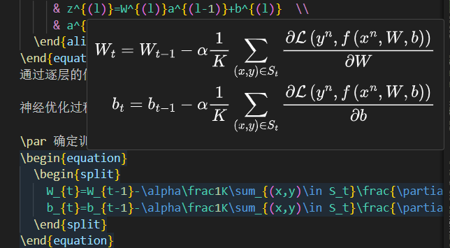
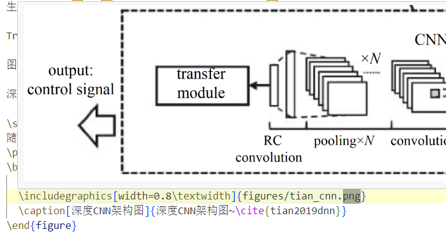
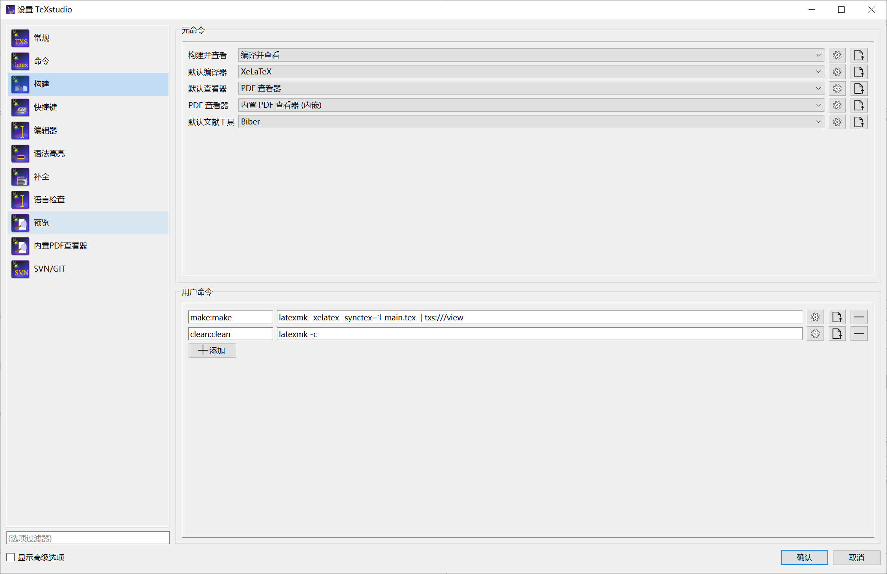

# AMS学术论文模板

## 起源

习惯使用Latex模板，奈何并未提供相关的Latex模板，花了两天时间按照Latex教程制作一份.建议考虑多种因素（个人及老师习惯、现有论文素材、熟悉程度等）判断是否使用。如果你觉得这个项目对你有帮助，请给一个⭐！
| 类型 | 优点说明  |缺点备注 |
|:--------| :---------|:--------|
|latex|  支持Git，修改版本较为方便， 目前不需要但是想保留的内容直接注释 公式排版漂亮，引用简单|需要编译，直接生成PDF， 修改不方便，需要Tex发行版或Overleaf|
|word| 官方提供，可见即所得， 修改或者检查容易|版本修订麻烦 格式容易发生变化|

## 使用及编译方法

### 推荐工作流
提供的样例`demo.pdf`当中提及到相关使用方法，大多来源于网络，请查阅后使用。

编写论文期间应当集中聚焦在内容写作上面，较好的工作流配置是`VSCode+Latex Workspace`插件，本地完全不需要安装Tex发行版,鼠标放置在`\begin{equation}或XXXX.png`即可显示公式或者图片，**一天编译1-2次生成PDF检查内容**即可.

<!--  -->

### 1. 基于Overleaf编译

可用，但是不建议作为边写边看的工具.原因是overleaf虽然在线编译但是随着论文内容增加，编译时间增加（特别是没有会员的时候），可能会抵消latex格式调整的节约出的时间.

需要进行的设置有 `菜单->编译器`选择`XeLatex`,主文档`main.tex`.

### 2.基于window本地编译（TexStudio+Latex）
推荐的编译命令为`latexmk -xelatex -synctex=1 main.tex`，`latexmk`命令的运行需要系统安装有Perl解释器.可以使用命令`latexmk -C`来删除编译产生的文件，可以使用命令`latexmk -c`来删除编译产生的临时文件.
建议设置自定义命令`make & clean`,

### 其他需要注意的事项
1. 当前大多数包已经导入，一般并不需要额外导入其他的包.导入的包及完成的设置：`graphicx(图片导入布局，导入figure或images不需要完整路径`,`amsmath`，`booktabs(三线表)`，`xcolor(字体颜色)`，`algorithm2e(算法库)`.如果需要其他库，请直接在`main.tex`当中进行导入.
1. 写论文过程中发现， 图表的布局格式选择`[htb]`效果表现是最优的，优先当前位置，其次顶端、再次底部，不建议添加p.
1. 文献引用直接使用`\cite{keyword}`，图表公式引用建议`~\ref{fig|tab|eq:keyword}~`注意前后空格，样子会漂亮很多（原因是全角2字符半角1字符的排版间距）.

## 当前已知问题Konwn Issues

1. 封面设计过于复杂，考虑格式要求，当前采用的方案：**Word填写基本信息-->生成并cover.pdf-->编译导入到项目或者直接使用PDF软件调整页面（推荐）**。另限于内部资料，不会提供Word模板及封面PDF，请自行生成。强烈推荐PDF软件`PDF-XChange Editor Plus`,下载地址为[https://www.ghxi.com/pdfxchangeeditorplus.html](https://www.ghxi.com/pdfxchangeeditorplus.html),使用软件编辑PDF，修改页面等较为方便。
1. 官方Word模板`参考文献`章节提供的示例内容本身并不能看出具体的格式要求，因此按照《国标GB/T7714-2015信息与文献参考文献著录规则》进行设置.另模板文件参考文献条目为首行缩进，略难看，不如悬挂缩进（latex模板默认设置）漂亮，如有需要可以修改注释内容自行调整.
1. 字体问题：overleaf官方基于Linux系统搭建，部分具有版权的字体（宋体、仿宋等）无法使用，**建议使用overleaf编写，最终成稿使用window进行本地编译,取消`amsthesis.cls`文档中的win字体注释**.具体参见`./docs/ctex.pdf`Page7字体相关章节.
1. 目前不太清楚单位的写法，如 `1m`还是`1~m`是否有空格.规范可能是分开，但是连写的也不少.
1. 写论文过程中发现可能公式会存在压页脚线的问题，建议解决方法是**内容前后增加或者删减部分内容，绕开此问题**.
1. 一级标题和二级标题的段前段后间距在Word当中表达较为奇怪，目前为暂定设置（此部分存在差异）。

## 修改历史

| 时间 | 修改说明  |
|:--------| :---------|
|2024/09/02|  按照提供的word模板，开始初版提交.|
|2024/09/15| 修改cls文件中关于浮动体（表格、图）的间距|
|2024/10/28| 完成模板提交|
|2024/11/05|修改完成ReadMe文件|

## 贡献

期待....

## 免责声明

本模板免费提供于同学们使用或修改，但 is provided "As IS".使用本模板产生的任何问题作者不承担任何直接或者间接责任.但本人会尽力帮助有需要的同学解决问题或者直接提Github Issue，请联系<chas5wasl@duck.com>.

## 参考资料

感谢以下项目：[CTeX](https://ctex.org)
